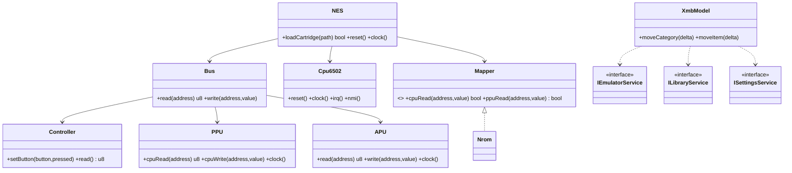
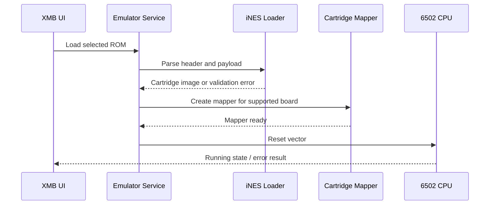

# UML and subsystem diagrams

## Emulator and console dashboard

```mermaid
classDiagram
  class NES { +loadCartridge(path) bool +reset() +clock() }
  class Bus { +read(address) u8 +write(address,value) }
  class Cpu6502 { +reset() +clock() +irq() +nmi() }
  class PPU { +cpuRead(address) u8 +cpuWrite(address,value) +clock() }
  class APU { +read(address) u8 +write(address,value) +clock() }
  class Mapper { <<interface>> +cpuRead(address,value) bool +ppuRead(address,value) bool }
  class Nrom
  class Controller { +setButton(button,pressed) +read() u8 }
  class XmbModel { +moveCategory(delta) +moveItem(delta) }
  class IEmulatorService { <<interface>> }
  class ILibraryService { <<interface>> }
  class ISettingsService { <<interface>> }
  NES --> Bus
  NES --> Cpu6502
  NES --> Mapper
  Mapper <|.. Nrom
  Bus --> Controller
  Bus --> PPU
  Bus --> APU
  XmbModel ..> IEmulatorService
  XmbModel ..> ILibraryService
  XmbModel ..> ISettingsService
```

## ROM loading sequence

```mermaid
sequenceDiagram
  participant UI as XMB UI
  participant Service as Emulator Service
  participant Loader as iNES Loader
  participant Mapper as Cartridge Mapper
  participant CPU as 6502 CPU
  UI->>Service: Load selected ROM
  Service->>Loader: Parse header and payload
  Loader-->>Service: Cartridge image or validation error
  Service->>Mapper: Create mapper for supported board
  Mapper-->>Service: Mapper ready
  Service->>CPU: Reset vector
  CPU-->>UI: Running state / error result
```

Interfaces shown for future layers do not imply all subsystems are complete; see DEVELOPMENT_STATUS.md.
